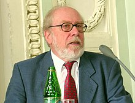

<table class="infobox biography vcard">
<tbody>
<tr>
<th colspan="2">

Professor

 

Niklaus Emil Wirth

 

PhD

</th>
</tr>
<tr>
<td colspan="2"></td>
</tr>
<tr>
<th scope="row">Born</th>
<td>15 February 1934&nbsp;(age&nbsp;86) 

<a title="Winterthur" href="https://en.wikipedia.org/wiki/Winterthur">Winterthur</a>, Switzerland

</td>
</tr>
<tr>
<th scope="row">Citizenship</th>
<td class="category"><a title="Switzerland" href="https://en.wikipedia.org/wiki/Switzerland">Switzerland</a></td>
</tr>
<tr>
<th scope="row">Education</th>
<td>

<ul>
<li><a title="Bachelor of Science" href="https://en.wikipedia.org/wiki/Bachelor_of_Science">BS</a>, ETH Zurich (1959)</li>
<li><a title="Master of Science" href="https://en.wikipedia.org/wiki/Master_of_Science">MSc</a>,&nbsp;<a title="Universit&eacute; Laval" href="https://en.wikipedia.org/wiki/Universit%C3%A9_Laval">Universit&eacute; Laval</a>&nbsp;(1959)</li>
<li>PhD,&nbsp;<a title="University of California, Berkeley" href="https://en.wikipedia.org/wiki/University_of_California,_Berkeley">University of California, Berkeley</a>&nbsp;(1963)</li>
</ul>

</td>
</tr>
<tr>
<th scope="row">Known&nbsp;for</th>
<td><a class="mw-redirect" title="Algol W" href="https://en.wikipedia.org/wiki/Algol_W">Algol W</a>,&nbsp;<a title="Euler (programming language)" href="https://en.wikipedia.org/wiki/Euler_(programming_language)">Euler</a>,&nbsp;<a title="Pascal (programming language)" href="https://en.wikipedia.org/wiki/Pascal_(programming_language)">Pascal</a>,&nbsp;<a title="Modula" href="https://en.wikipedia.org/wiki/Modula">Modula</a>,&nbsp;<a title="Modula-2" href="https://en.wikipedia.org/wiki/Modula-2">Modula-2</a>,&nbsp;<a class="mw-redirect" title="Oberon programming language" href="https://en.wikipedia.org/wiki/Oberon_programming_language">Oberon</a>,&nbsp;<a title="Oberon-2" href="https://en.wikipedia.org/wiki/Oberon-2">Oberon-2</a>,&nbsp;<a title="Oberon (programming language)" href="https://en.wikipedia.org/wiki/Oberon_(programming_language)#Oberon-07">Oberon-07</a>,&nbsp;<a class="mw-redirect" title="Oberon operating system" href="https://en.wikipedia.org/wiki/Oberon_operating_system">Oberon System</a></td>
</tr>
<tr>
<th scope="row">Awards</th>
<td>

<ul>
<li><a title="Turing Award" href="https://en.wikipedia.org/wiki/Turing_Award">Turing Award</a>&nbsp;(1984)</li>
<li><a title="SIGPLAN" href="https://en.wikipedia.org/wiki/SIGPLAN">SIGPLAN</a>&nbsp;Programming Languages Achievement Award</li>
<li>Fellow of the&nbsp;<a title="Computer History Museum" href="https://en.wikipedia.org/wiki/Computer_History_Museum">Computer History Museum</a>&nbsp;(2004)</li>
<li><a title="Marcel Benoist Prize" href="https://en.wikipedia.org/wiki/Marcel_Benoist_Prize">Marcel Benoist Prize</a>&nbsp;(1989)</li>
</ul>

</td>
</tr>
<tr>
<td colspan="2"><strong>Scientific career</strong></td>
</tr>
<tr>
<th scope="row">Fields</th>
<td class="category"><a title="Computer science" href="https://en.wikipedia.org/wiki/Computer_science">Computer science</a></td>
</tr>
<tr>
<th scope="row">Institutions</th>
<td>

<ul>
<li><a title="ETH Zurich" href="https://en.wikipedia.org/wiki/ETH_Zurich">ETH Zurich</a></li>
<li><a title="Stanford University" href="https://en.wikipedia.org/wiki/Stanford_University">Stanford University</a></li>
<li><a title="University of Zurich" href="https://en.wikipedia.org/wiki/University_of_Zurich">University of Zurich</a></li>
<li><a class="mw-redirect" title="Xerox PARC" href="https://en.wikipedia.org/wiki/Xerox_PARC">Xerox PARC</a></li>
</ul>

</td>
</tr>
<tr>
<th scope="row"><a title="Thesis" href="https://en.wikipedia.org/wiki/Thesis">Thesis</a></th>
<td><em>A Generalization of Algol</em>&nbsp;(1963)</td>
</tr>
<tr>
<th scope="row"><a title="Doctoral advisor" href="https://en.wikipedia.org/wiki/Doctoral_advisor">Doctoral advisor</a></th>
<td><a title="Harry Huskey" href="https://en.wikipedia.org/wiki/Harry_Huskey">Harry Huskey</a></td>
</tr>
<tr>
<th scope="row">Doctoral students</th>
<td><a title="Michael Franz" href="https://en.wikipedia.org/wiki/Michael_Franz">Michael Franz</a></td>
</tr>
</tbody>
</table>
 
<h2>Niklaus Wirth</h2>

Born February 15, 1934, Winterthur, Switzerland, early Promoter of good programming practices; developer of the programming languages Pascal, Modula-2, and Oberon; recipient of the 1984 ACM Turing Award.

 

<h2>Publications: </h2>

<ul>
  
 <li><b><a target="_blank" href="https://github.com/manjunath5496/Publications-By-Niklaus-Wirth/blob/master/niw(1).pdf" style="text-decoration:none;">The Programming Language Pascal</a></b></li>
  
<li><b><a target="_blank" href="https://github.com/manjunath5496/Publications-By-Niklaus-Wirth/blob/master/niw(2).pdf" style="text-decoration:none;">An axiomatic definition of the programming language Pascal </a></b></li>

<li><b><a target="_blank" href="https://github.com/manjunath5496/Publications-By-Niklaus-Wirth/blob/master/niw(3).pdf" style="text-decoration:none;">PASCAL User Manual and Report</a></b></li>                         
  <li><b><a target="_blank" href="https://github.com/manjunath5496/Publications-By-Niklaus-Wirth/blob/master/niw(4).pdf" style="text-decoration:none;">Algorithms + Data Structures = Programs</a></b></li>
  
 <li><b><a target="_blank" href="https://github.com/manjunath5496/Publications-By-Niklaus-Wirth/blob/master/niw(5).pdf" style="text-decoration:none;">The Design of an Operating System, a Compiler, and a Computer</a></b></li>  
 
   <li><b><a target="_blank" href="https://github.com/manjunath5496/Publications-By-Niklaus-Wirth/blob/master/niw(6).pdf" style="text-decoration:none;">Programming in Oberon: Steps Beyond Pascal and Modula</a></b></li>  
                                             

 <li><b><a target="_blank" href="https://github.com/manjunath5496/Publications-By-Niklaus-Wirth/blob/master/niw(7).pdf" style="text-decoration:none;">A Plea for Lean Software</a></b></li>

  
<li><b><a target="_blank" href="https://github.com/manjunath5496/Publications-By-Niklaus-Wirth/blob/master/niw(8).pdf" style="text-decoration:none;">Tasks versus Threads: An Alternative Multiprocessing Paradigm</a></b></li>
<li><b><a target="_blank" href="https://github.com/manjunath5496/Publications-By-Niklaus-Wirth/blob/master/niw(9).pdf" style="text-decoration:none;">Program Development by Stepwise Refinement</a></b></li>

</ul>

